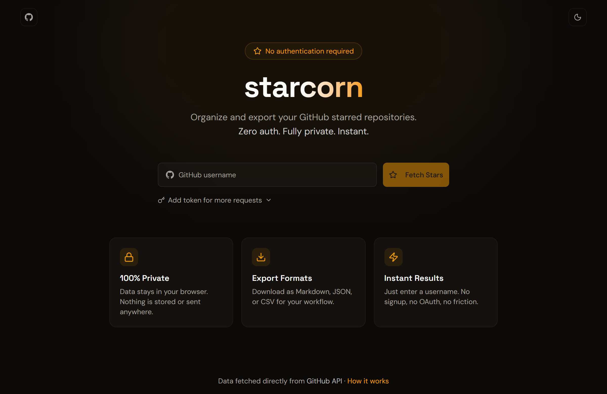

<div align="center">
    <a href="https://starcorn.dev">
        
    </a>

# starcorn

Organize, filter, and export GitHub stars. Fully client-side.

[](https://nextjs.org)
[](https://www.typescriptlang.org)
[](https://tailwindcss.com)
[](https://ui.shadcn.com)


</div>

## Live Demo

Check out the live site at **[starcorn.dev](https://starcorn.dev)**

<p align="center">
    
</p>

## Features

- **Auto-categorization** - Stars sorted into 20 categories (AI, DevTools, UI Components, etc.)
- **Search & filter** - Find repos across all categories
- **Export** - Download as Markdown, JSON, or CSV
- **Privacy-first** - No OAuth, no data stored, runs entirely in your browser

## How It Works

1. Enter any GitHub username
2. View stars organized by category
3. Export your organized list

For more details, visit [How It Works](https://starcorn.dev/how-it-works).

## Getting Started

### Running the Application

To get started locally, follow these steps:

1. **Clone the repository:**

   ```bash
   git clone https://github.com/nathan-abela/starcorn.git
   ```

2. **Install Dependencies:**

   ```bash
   npm install
   ```

3. **Start the development server:**

   ```bash
   npm run dev
   ```

4. **Open your browser:**

   Navigate to [http://localhost:3000](http://localhost:3000) to see the application.

## Technologies Used

- [Next.js](https://nextjs.org)
- [TypeScript](https://www.typescriptlang.org)
- [Tailwind CSS](https://tailwindcss.com)
- [shadcn/ui](https://ui.shadcn.com)

---

<p align="center">
    
</p>
